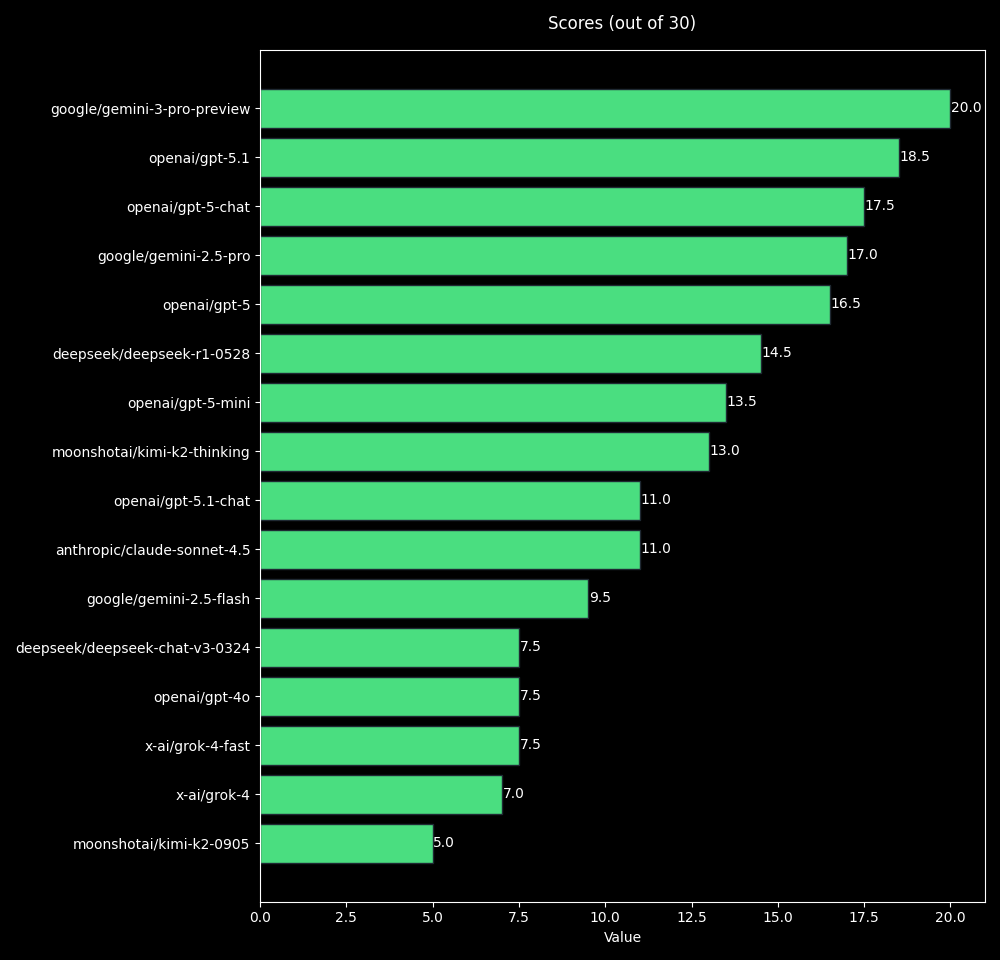

# PitchBench

A simple experimental benchmark to test the ability of language models to retrieve pitch accent patterns for Japanese words.

## Setup

1. Clone the repository:
2. Install the required packages:
   ```bash
   pip install -r requirements.txt
   ```
3. Set up your OpenRouter API key in the .env file based on the template.
4. Run the benchmark:
   ```bash
   python main.py
   ```

## Methodology

In a prompt, 30 japanese words are provided, and the model is asked to return their pitch accent patterns in Tokyo Standard Japanese using specific labels (H, A, N2, N3, ..., O). The results are compared against a predefined solution to calculate scores and token usage:
- 1 point is awarded for each correct pitch accent pattern.
- 0.5 is awarded if the model guessed a correct pattern within multiple possible answers. 
- 0 is awarded if the model makes a wrong guess or guesses too many accents for a single word.


## Results


