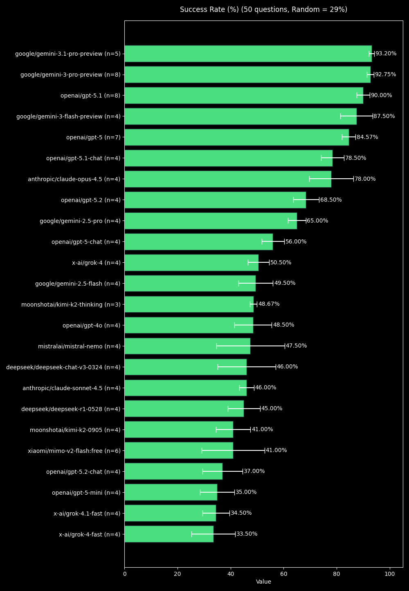
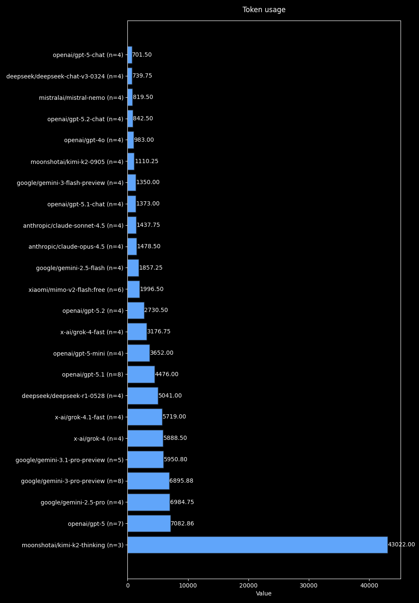
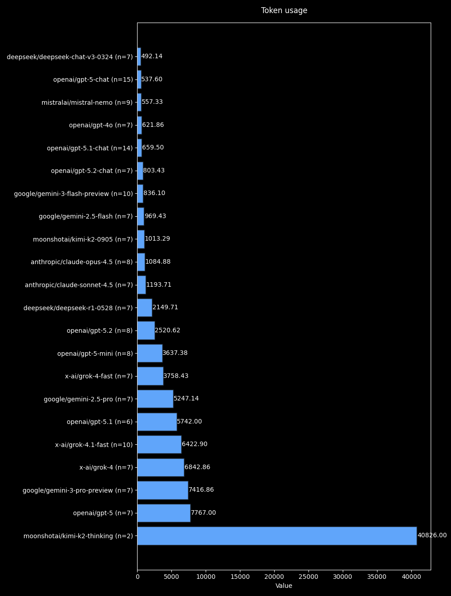

# PitchBench

A simple experimental benchmark to test the ability of language models to retrieve pitch accent patterns for Japanese words.

## Versions
- **V1**: A proof-of-concept benchmark using a non-optimized, manually added medical and misc vocabulary. Results are scored out of 30.

- **V2**: An improved benchmark using a random sample of words that follows Zipf’s Law in the [BCCWJ SUW LUW Combined](https://github.com/Kuuuube/yomitan-dictionaries) word frequency dictionary (originally for Yomitan). This benchmark should much more accurately evaluate a model's ability to predict pitch accent in natural Japanese text. Results are reported as a percentage, based on the success-rate of 50 words.

## Setup

1. Clone the repository:
2. Install the required packages:
   ```bash
   pip install -r requirements.txt
   ```
3. Set up your OpenRouter API key in the .env file based on the template.
4. Run the benchmark:
   ```bash
   cd v2 # or cd v1
   python main.py
   ```

## Methodology

**V1**

In a prompt, 30 japanese words are provided, and the model is asked to return their pitch accent patterns in Tokyo Standard Japanese using specific labels (H, A, N2, N3, ..., O). The results are compared against a predefined solution to calculate scores and token usage:
- 1 point is awarded for each correct pitch accent pattern.
- 0.5 is awarded if the model guessed a correct pattern within multiple possible answers. 
- 0 is awarded if the model makes a wrong guess or guesses too many accents for a single word.


**V2**

Same as above, except:
- 50 words are provided.
- 1 point is awarded regardless of if multiple pitch accents were valid.
- Pitch accent patterns are simplified to H, A, N, and O, and a model only provides one per word.

## Results

**V2**




**V1**



